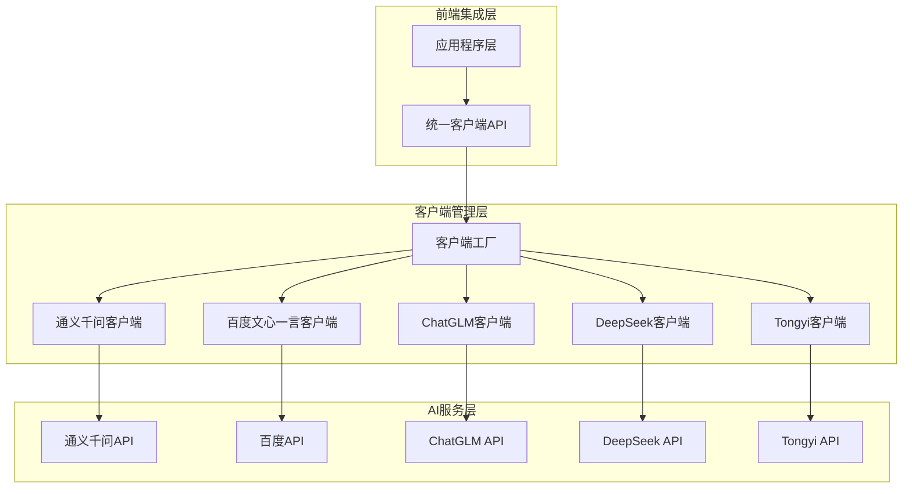
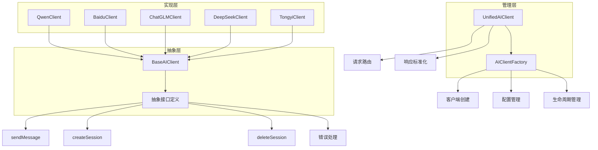
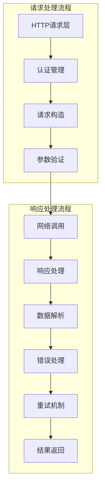
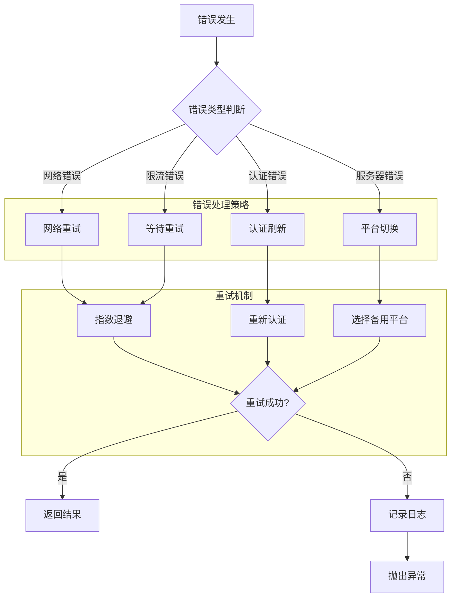
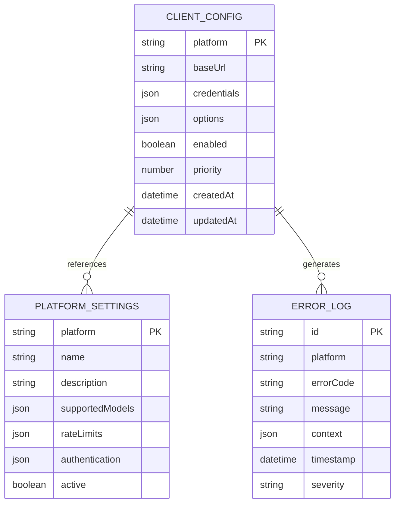

# AI平台客户端集成系统技术架构文档

## 1. 架构设计

### 1.1 整体架构图



### 1.2 核心组件架构



## 2. 技术描述

### 2.1 核心技术栈

- **前端**: TypeScript@5.0 + Node.js@18
- **初始化工具**: npm
- **HTTP客户端**: 原生Fetch API
- **构建工具**: TypeScript编译器
- **测试框架**: Jest + @types/jest
- **代码质量**: ESLint + Prettier
- **包管理**: npm workspaces

### 2.2 依赖库

```json
{
  "dependencies": {
    "typescript": "^5.0.0",
    "@types/node": "^18.0.0"
  },
  "devDependencies": {
    "jest": "^29.0.0",
    "@types/jest": "^29.0.0",
    "ts-jest": "^29.0.0",
    "eslint": "^8.0.0",
    "@typescript-eslint/eslint-plugin": "^5.0.0",
    "@typescript-eslint/parser": "^5.0.0",
    "prettier": "^2.0.0"
  }
}
```

### 2.3 开发环境要求

- Node.js版本: 16.x 或更高版本
- TypeScript版本: 4.5 或更高版本
- 包管理器: npm 7.x 或更高版本
- 操作系统: Windows/macOS/Linux

## 3. 路由定义

### 3.1 模块导出结构

| 导出路径 | 用途 | 类型 |
|----------|------|------|
| `/index` | 主入口文件 | 统一导出所有公共API |
| `/types/ai_client_types` | 类型定义 | 所有接口和枚举类型 |
| `/api/endpoints/base_ai_client` | 基类 | 抽象基类定义 |
| `/api/endpoints/ai_client_factory` | 工厂类 | 客户端实例创建 |
| `/api/endpoints/unified_ai_client` | 统一客户端 | 统一API接口 |
| `/clients/*` | 平台客户端 | 各平台具体实现 |

### 3.2 核心API接口

```typescript
// 统一客户端接口
interface UnifiedAIClient {
  constructor(platform: AIPlatformType, credentials: ClientCredentials): void
  sendMessage(message: string, options?: SendMessageOptions): Promise<AsyncIterable<string>>
  createSession(): Promise<string>
  deleteSession(sessionId: string): Promise<void>
  switchPlatform(platform: AIPlatformType): void
}

// 工厂接口
interface AIClientFactory {
  createClient(platform: AIPlatformType, credentials: ClientCredentials): BaseAIClient
  getSupportedPlatforms(): AIPlatformType[]
  validateCredentials(platform: AIPlatformType, credentials: ClientCredentials): boolean
}
```

## 4. API定义

### 4.1 核心类型定义

#### 平台类型枚举
```typescript
export const AIPlatformType = {
    CHATGLM: "chatglm",
    TONGYI: "tongyi", 
    BAIDU: "baidu",
    DEEPSEEK: "deepseek",
    QWEN: "qwen",
} as const;
```

#### 认证信息接口
```typescript
export interface ClientCredentials {
    cookies: string;
    apiKey?: string;
    model?: string;
    chatId?: string;
    [key: string]: any; // 平台特定字段
}
```

#### 消息选项接口
```typescript
export interface SendMessageOptions {
    conversationId?: string;
    parentId?: string;
    timeout?: number;
    maxRetries?: number;
    retryDelay?: number;
    [key: string]: any; // 平台特定选项
}
```

### 4.2 客户端接口定义

```typescript
export interface AIPlatformClientInterface {
    baseUrl: string;
    
    // 会话管理
    createSession(): Promise<string>;
    deleteSession(sessionId: string): Promise<void>;
    
    // 消息发送
    sendMessage(
        message: string,
        options?: SendMessageOptions
    ): Promise<AsyncIterable<string>>;
    
    // 系统消息
    sendSystemMessage?(
        message: string,
        options?: SendMessageOptions
    ): Promise<AsyncIterable<string>>;
}
```

### 4.3 错误类型定义

```typescript
export class AIClientError extends Error {
    constructor(
        message: string,
        public code: string,
        public platform?: AIPlatformType,
        public statusCode?: number
    ) {
        super(message);
        this.name = 'AIClientError';
    }
}

export enum ErrorCode {
    NETWORK_ERROR = 'NETWORK_ERROR',
    AUTHENTICATION_ERROR = 'AUTHENTICATION_ERROR',
    RATE_LIMIT_ERROR = 'RATE_LIMIT_ERROR',
    INVALID_REQUEST = 'INVALID_REQUEST',
    SERVER_ERROR = 'SERVER_ERROR',
    TIMEOUT_ERROR = 'TIMEOUT_ERROR'
}
```

## 5. 服务器架构设计

### 5.1 客户端内部架构



### 5.2 错误处理架构



## 6. 数据模型

### 6.1 客户端配置模型



### 6.2 运行时数据结构

```typescript
// 客户端运行时状态
interface ClientRuntimeState {
    sessionId: string;
    isAuthenticated: boolean;
    lastUsed: Date;
    requestCount: number;
    errorCount: number;
    averageResponseTime: number;
}

// 平台健康状态
interface PlatformHealth {
    platform: AIPlatformType;
    status: 'healthy' | 'degraded' | 'unhealthy';
    responseTime: number;
    successRate: number;
    lastCheck: Date;
}

// 请求上下文
interface RequestContext {
    requestId: string;
    platform: AIPlatformType;
    message: string;
    options: SendMessageOptions;
    startTime: Date;
    retryCount: number;
}
```

## 7. 性能优化策略

### 7.1 连接池管理

```typescript
class ConnectionPool {
    private pools: Map<AIPlatformType, Pool> = new Map();
    
    constructor(
        private maxConnections: number = 10,
        private idleTimeout: number = 30000
    ) {}
    
    async getConnection(platform: AIPlatformType): Promise<Connection> {
        const pool = this.getOrCreatePool(platform);
        return pool.acquire();
    }
    
    private getOrCreatePool(platform: AIPlatformType): Pool {
        if (!this.pools.has(platform)) {
            this.pools.set(platform, new Pool({
                max: this.maxConnections,
                idleTimeoutMillis: this.idleTimeout,
                create: () => this.createConnection(platform),
                destroy: (connection) => connection.close()
            }));
        }
        return this.pools.get(platform)!;
    }
}
```

### 7.2 缓存策略

```typescript
class ResponseCache {
    private cache: Map<string, CacheEntry> = new Map();
    private ttl: number = 300000; // 5分钟
    
    async get(key: string): Promise<AsyncIterable<string> | null> {
        const entry = this.cache.get(key);
        if (!entry || Date.now() - entry.timestamp > this.ttl) {
            return null;
        }
        return entry.data;
    }
    
    async set(key: string, data: AsyncIterable<string>): Promise<void> {
        this.cache.set(key, {
            data,
            timestamp: Date.now()
        });
    }
}
```

## 8. 安全设计

### 8.1 认证安全

```typescript
class SecureCredentialManager {
    private encryptionKey: string;
    
    constructor() {
        this.encryptionKey = this.generateEncryptionKey();
    }
    
    encryptCredentials(credentials: ClientCredentials): EncryptedCredentials {
        const encrypted = this.encrypt(JSON.stringify(credentials));
        return {
            data: encrypted,
            algorithm: 'AES-256-GCM',
            timestamp: Date.now()
        };
    }
    
    decryptCredentials(encrypted: EncryptedCredentials): ClientCredentials {
        const decrypted = this.decrypt(encrypted.data);
        return JSON.parse(decrypted);
    }
    
    private generateEncryptionKey(): string {
        return crypto.randomBytes(32).toString('hex');
    }
}
```

### 8.2 请求安全

```typescript
class RequestSecurity {
    private rateLimiter: Map<string, RateLimitInfo> = new Map();
    
    async validateRequest(
        platform: AIPlatformType,
        credentials: ClientCredentials
    ): Promise<boolean> {
        // 验证请求频率
        if (!this.checkRateLimit(platform)) {
            throw new AIClientError(
                'Rate limit exceeded',
                ErrorCode.RATE_LIMIT_ERROR,
                platform
            );
        }
        
        // 验证认证信息
        if (!this.validateCredentials(credentials)) {
            throw new AIClientError(
                'Invalid credentials',
                ErrorCode.AUTHENTICATION_ERROR,
                platform
            );
        }
        
        return true;
    }
    
    private checkRateLimit(platform: AIPlatformType): boolean {
        const now = Date.now();
        const limitInfo = this.rateLimiter.get(platform);
        
        if (!limitInfo || now - limitInfo.resetTime > 60000) {
            this.rateLimiter.set(platform, {
                count: 1,
                resetTime: now + 60000
            });
            return true;
        }
        
        if (limitInfo.count >= this.getPlatformLimit(platform)) {
            return false;
        }
        
        limitInfo.count++;
        return true;
    }
}
```

## 9. 监控与日志

### 9.1 性能监控

```typescript
class PerformanceMonitor {
    private metrics: Map<string, PerformanceMetric> = new Map();
    
    recordMetric(
        platform: AIPlatformType,
        metric: string,
        value: number,
        tags?: Record<string, string>
    ): void {
        const key = `${platform}:${metric}`;
        const existing = this.metrics.get(key) || {
            count: 0,
            sum: 0,
            min: Infinity,
            max: -Infinity,
            values: []
        };
        
        existing.count++;
        existing.sum += value;
        existing.min = Math.min(existing.min, value);
        existing.max = Math.max(existing.max, value);
        existing.values.push(value);
        
        this.metrics.set(key, existing);
    }
    
    getStats(platform: AIPlatformType, metric: string): MetricStats {
        const data = this.metrics.get(`${platform}:${metric}`);
        if (!data || data.count === 0) {
            return null;
        }
        
        return {
            average: data.sum / data.count,
            min: data.min,
            max: data.max,
            count: data.count,
            p95: this.calculatePercentile(data.values, 0.95),
            p99: this.calculatePercentile(data.values, 0.99)
        };
    }
}
```

### 9.2 日志管理

```typescript
class Logger {
    private logLevel: LogLevel = LogLevel.INFO;
    
    constructor(
        private component: string,
        private enableConsole: boolean = true
    ) {}
    
    log(level: LogLevel, message: string, context?: any): void {
        if (level < this.logLevel) {
            return;
        }
        
        const logEntry: LogEntry = {
            timestamp: new Date().toISOString(),
            level,
            component: this.component,
            message,
            context: this.sanitizeContext(context)
        };
        
        if (this.enableConsole) {
            console.log(JSON.stringify(logEntry));
        }
        
        // 发送到远程日志服务
        this.sendToLogService(logEntry);
    }
    
    private sanitizeContext(context: any): any {
        // 移除敏感信息
        const sensitiveKeys = ['password', 'apiKey', 'token', 'cookie'];
        return this.deepSanitize(context, sensitiveKeys);
    }
}
```

## 10. 部署与运维

### 10.1 环境配置

```typescript
// 环境变量配置
interface EnvironmentConfig {
    nodeEnv: 'development' | 'production' | 'test';
    logLevel: LogLevel;
    maxRetries: number;
    timeout: number;
    enableCache: boolean;
    enableMetrics: boolean;
    encryptionKey?: string;
}

// 配置文件管理
class ConfigManager {
    private config: EnvironmentConfig;
    
    constructor() {
        this.config = this.loadConfig();
    }
    
    private loadConfig(): EnvironmentConfig {
        return {
            nodeEnv: process.env.NODE_ENV as EnvironmentConfig['nodeEnv'] || 'development',
            logLevel: this.parseLogLevel(process.env.LOG_LEVEL),
            maxRetries: parseInt(process.env.MAX_RETRIES || '3'),
            timeout: parseInt(process.env.REQUEST_TIMEOUT || '30000'),
            enableCache: process.env.ENABLE_CACHE === 'true',
            enableMetrics: process.env.ENABLE_METRICS === 'true',
            encryptionKey: process.env.ENCRYPTION_KEY
        };
    }
    
    getConfig(): EnvironmentConfig {
        return { ...this.config };
    }
}
```

### 10.2 健康检查

```typescript
class HealthCheck {
    constructor(
        private clientFactory: AIClientFactory,
        private monitor: PerformanceMonitor
    ) {}
    
    async checkHealth(): Promise<HealthStatus> {
        const platforms = this.clientFactory.getSupportedPlatforms();
        const results: PlatformHealth[] = [];
        
        for (const platform of platforms) {
            try {
                const health = await this.checkPlatformHealth(platform);
                results.push(health);
            } catch (error) {
                results.push({
                    platform,
                    status: 'unhealthy',
                    responseTime: -1,
                    successRate: 0,
                    lastCheck: new Date(),
                    error: error.message
                });
            }
        }
        
        return {
            overall: this.calculateOverallHealth(results),
            platforms: results,
            timestamp: new Date()
        };
    }
    
    private async checkPlatformHealth(platform: AIPlatformType): Promise<PlatformHealth> {
        const startTime = Date.now();
        
        // 执行简单的健康检查请求
        const client = this.clientFactory.createClient(platform, {} as ClientCredentials);
        
        // 这里可以执行一个简单的测试请求
        const success = await this.performHealthTest(client);
        
        const responseTime = Date.now() - startTime;
        const stats = this.monitor.getStats(platform, 'success_rate');
        
        return {
            platform,
            status: success ? 'healthy' : 'unhealthy',
            responseTime,
            successRate: stats?.average || 0,
            lastCheck: new Date()
        };
    }
}
```

这个技术架构文档详细描述了AI平台客户端集成系统的技术实现方案，包括架构设计、API定义、性能优化、安全设计、监控日志等各个方面，为项目的开发和维护提供了完整的技术指导。