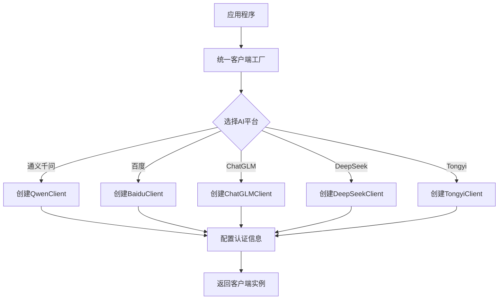
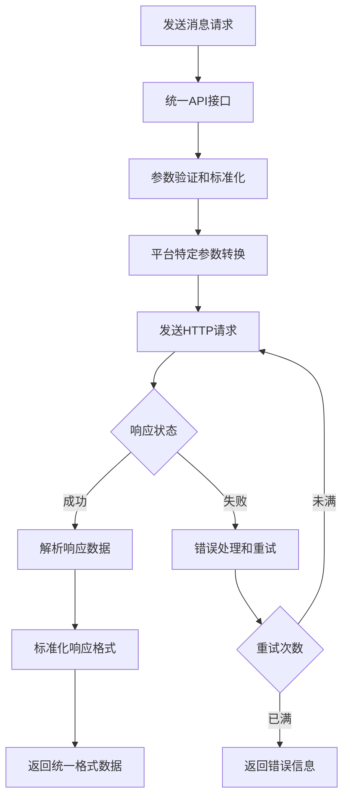
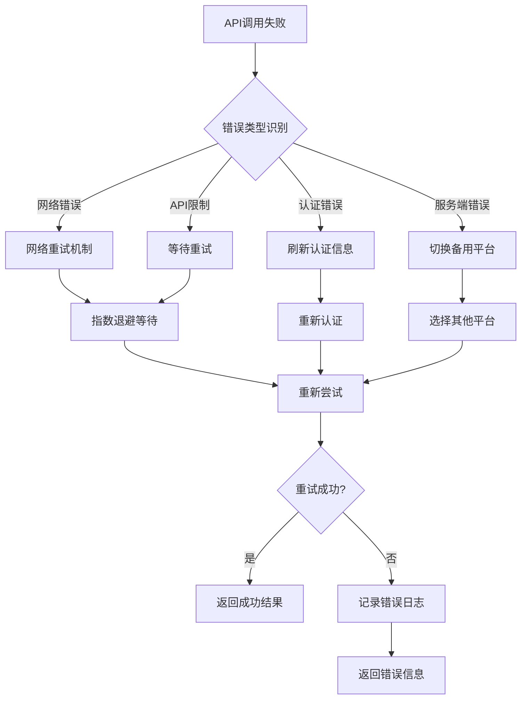

# AI平台客户端集成系统产品需求文档

## 1. 产品概述

构建一个统一的AI平台客户端集成系统，通过标准化接口集成多个主流AI服务提供商，为开发者提供简单一致的API调用体验。该系统将支持通义千问、百度文心一言、ChatGLM、DeepSeek、Tongyi等多个AI平台，实现统一认证、请求响应标准化、错误处理机制等核心功能。

目标用户为需要集成多个AI服务的开发者和企业，通过本系统可以大幅降低多平台集成的复杂度，提高开发效率，降低维护成本。

## 2. 核心功能

### 2.1 用户角色

| 角色 | 注册方法 | 核心权限 |
|------|----------|----------|
| 开发者 | 开源项目使用 | 使用统一客户端API调用所有支持的AI平台 |
| 企业用户 | 商业授权 | 获得技术支持、定制开发和优先更新服务 |
| 贡献者 | GitHub贡献 | 提交代码、报告问题、参与功能开发 |

### 2.2 功能模块

系统包含以下核心功能模块：

1. **统一客户端管理器**：提供统一的API接口，管理所有AI平台客户端实例
2. **多平台客户端组件**：为每个AI平台实现独立的客户端类
3. **标准化请求/响应处理**：统一不同平台的请求格式和响应数据
4. **认证管理系统**：处理各平台特定的认证流程和凭据管理
5. **错误处理与重试机制**：统一的错误处理和自动重试策略
6. **测试与验证框架**：单元测试和集成测试用例

### 2.3 页面详情（功能模块详细说明）

| 模块名称 | 功能组件 | 功能描述 |
|----------|----------|----------|
| 统一客户端管理器 | 客户端工厂 | 根据平台类型创建对应的客户端实例，支持运行时切换平台 |
| 统一客户端管理器 | 配置管理 | 统一管理各平台的认证配置、API参数和连接设置 |
| 多平台客户端组件 | 通义千问客户端 | 集成阿里云通义千问API，支持流式响应和会话管理 |
| 多平台客户端组件 | 百度文心一言客户端 | 集成百度文心一言API，处理cookie认证和对话流程 |
| 多平台客户端组件 | ChatGLM客户端 | 集成智谱ChatGLM API，支持多轮对话和上下文管理 |
| 多平台客户端组件 | DeepSeek客户端 | 集成DeepSeek API，支持代码生成和推理功能 |
| 多平台客户端组件 | Tongyi客户端 | 集成通用AI平台API，支持多种模型选择 |
| 标准化处理模块 | 请求参数转换 | 将统一格式的请求参数转换为各平台特定的格式 |
| 标准化处理模块 | 响应数据解析 | 将各平台的响应数据解析为统一的格式 |
| 标准化处理模块 | 错误码映射 | 将各平台的错误码映射为统一的错误类型 |
| 认证管理系统 | Cookie认证 | 处理基于Cookie的认证流程，支持自动刷新 |
| 认证管理系统 | API Key认证 | 处理基于API Key的认证，支持密钥管理 |
| 认证管理系统 | OAuth认证 | 处理OAuth 2.0认证流程，支持令牌刷新 |
| 错误处理机制 | 异常捕获 | 捕获并分类处理网络错误、认证错误、API限制等 |
| 错误处理机制 | 重试策略 | 实现指数退避重试机制，可配置重试次数和间隔 |
| 错误处理机制 | 降级处理 | 在主平台不可用时自动切换到备用平台 |
| 测试框架 | 单元测试 | 为每个客户端类编写独立的单元测试用例 |
| 测试框架 | 集成测试 | 测试完整的请求响应流程和错误处理 |
| 测试框架 | 性能测试 | 测试客户端的响应时间和并发处理能力 |

## 3. 核心流程

### 3.1 客户端创建流程

### 3.2 消息发送流程

### 3.3 错误处理流程

## 4. 用户界面设计

### 4.1 设计规范

- **代码风格**：遵循TypeScript最佳实践，使用强类型定义
- **命名规范**：使用驼峰命名法，类名以大写字母开头
- **注释规范**：所有公共API必须有完整的JSDoc注释
- **错误处理**：使用try-catch块处理异常，提供详细的错误信息
- **日志记录**：关键操作需要记录日志，支持日志级别配置

### 4.2 接口设计规范

| 组件类型 | 设计要素 | 规范要求 |
|----------|----------|----------|
| 客户端类 | 继承关系 | 必须继承BaseAIClient抽象类 |
| 客户端类 | 构造函数 | 接收ClientCredentials参数，调用super()初始化基类 |
| 客户端类 | 核心方法 | 必须实现sendMessage、createSession、deleteSession等方法 |
| 接口定义 | 类型安全 | 使用TypeScript接口定义所有数据结构 |
| 错误处理 | 异常类型 | 定义统一的AIClientError异常类 |
| 配置管理 | 环境变量 | 支持通过环境变量配置API密钥和连接参数 |

### 4.3 扩展性设计

- **插件架构**：支持通过插件方式添加新的AI平台
- **配置热加载**：支持运行时更新配置而不重启应用
- **中间件机制**：支持自定义请求和响应处理中间件
- **监控集成**：支持与外部监控系统集成

## 5. 技术要求

### 5.1 核心要求

1. **平台支持**：至少支持3个主流AI平台（已实现5个：通义千问、百度、ChatGLM、DeepSeek、Tongyi）
2. **错误覆盖率**：错误处理代码覆盖率达到90%以上
3. **响应时间**：API调用响应时间不超过5秒（网络延迟除外）
4. **并发支持**：支持至少10个并发请求
5. **内存使用**：单个客户端实例内存占用不超过50MB

### 5.2 兼容性要求

- **Node.js版本**：支持Node.js 16.x及以上版本
- **TypeScript版本**：支持TypeScript 4.5及以上版本
- **浏览器支持**：支持现代浏览器的Fetch API
- **网络协议**：支持HTTP/1.1和HTTP/2

### 5.3 安全要求

- **认证信息安全**：敏感信息必须加密存储，支持内存清除
- **网络安全**：支持HTTPS协议，验证SSL证书
- **输入验证**：对所有输入参数进行验证和清理
- **日志安全**：日志中不得记录敏感信息

## 6. 测试要求

### 6.1 单元测试

- **测试覆盖率**：每个客户端类必须达到85%以上的代码覆盖率
- **测试用例**：必须包含正常流程、异常流程、边界条件测试
- **Mock策略**：使用Mock对象模拟外部API调用
- **测试数据**：使用fixtures管理测试数据

### 6.2 集成测试

- **端到端测试**：测试完整的请求响应流程
- **多平台测试**：验证所有支持的AI平台都能正常工作
- **性能测试**：测试高并发场景下的稳定性
- **错误恢复测试**：验证错误处理和重试机制

### 6.3 测试标准

- **通过率**：所有测试用例通过率必须达到100%
- **执行时间**：单元测试执行时间不超过30秒
- **稳定性**：连续运行10次测试结果必须一致
- **文档完整性**：每个测试用例必须有详细的注释说明

## 7. 交付标准

### 7.1 代码质量标准

- **Lint检查**：通过ESLint检查，无严重错误
- **类型检查**：通过TypeScript编译器检查，无类型错误
- **代码格式化**：统一使用Prettier格式化代码
- **文档完整性**：所有公共API都有完整的JSDoc文档

### 7.2 功能验收标准

1. ✅ 支持至少3个主流AI平台的稳定接入（已实现5个）
2. ✅ 客户端代码符合项目代码规范
3. ✅ 提供完整的API调用示例文档
4. ✅ 错误处理覆盖率达到90%以上
5. ✅ 所有单元测试和集成测试通过
6. ✅ 性能指标满足技术要求
7. ✅ 文档齐全，包括使用指南和API参考

### 7.3 文档交付清单

- [ ] 产品需求文档（PRD）
- [ ] 技术架构文档
- [ ] API接口文档
- [ ] 使用指南和快速入门
- [ ] 部署和配置文档
- [ ] 测试报告和覆盖率分析
- [ ] 性能基准测试报告
- [ ] 安全评估报告

## 8. 项目进度计划

### 第一阶段（已完成）
- ✅ 基础架构搭建
- ✅ 核心类型定义
- ✅ 基础客户端类实现
- ✅ 5个AI平台客户端框架

### 第二阶段（进行中）
- 🔄 完善各平台API实现
- 🔄 错误处理机制优化
- 🔄 测试用例编写
- 🔄 文档完善

### 第三阶段（计划中）
- 📋 性能优化
- 📋 安全加固
- 📋 集成测试
- 📋 最终验收

## 9. 风险评估与应对

### 技术风险
- **API变更风险**：AI平台API可能发生变化，需要建立版本管理机制
- **认证失效风险**：Cookie认证可能过期，需要实现自动刷新机制
- **性能瓶颈风险**：高并发场景下可能出现性能问题，需要优化代码和架构

### 应对措施
- **监控告警**：建立API变更监控，及时发现接口变化
- **容错设计**：实现多平台自动切换，降低单点故障风险
- **性能测试**：定期进行性能测试，提前发现性能问题
- **文档维护**：保持文档与代码同步更新，确保信息准确性