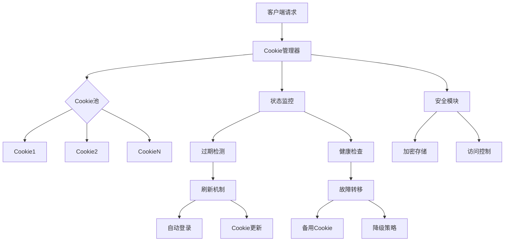

# Cookie授权管理机制改进文档

## 1. 当前认证机制分析

### 1.1 现有实现概述

目前项目中Cookie认证相关功能主要集中在以下几个方面：

1. **基础认证接口** (`ClientCredentials`)
   - 仅包含简单的 `cookies: string` 字段
   - 使用 `[key: string]: any` 扩展属性存储平台特定字段
   - 缺乏标准化的Cookie结构定义

2. **Cookie提取方法** (`extractCredentialsFromCookies`)
   - 各客户端独立实现Cookie解析逻辑
   - 仅支持从Cookie字符串中提取认证信息
   - 缺少Cookie验证和有效性检查

3. **认证信息使用**
   - 直接透传Cookie字符串到HTTP请求头
   - 无Cookie状态管理和生命周期控制
   - 缺少错误重试和刷新机制

### 1.2 存在的问题

#### 🔴 关键问题
1. **无Cookie池管理**：无法管理多个账号的Cookie
2. **无自动刷新机制**：Cookie过期后无法自动更新
3. **无安全存储**：Cookie明文存储，存在泄露风险
4. **无过期检测**：无法在Cookie过期前预警
5. **无统一验证**：缺少Cookie有效性验证机制

#### 🟡 次要问题
1. **平台差异处理不足**：各平台Cookie结构差异大，缺少统一适配
2. **错误处理薄弱**：Cookie失效时无优雅的降级策略
3. **监控缺失**：无法监控Cookie使用状态和异常
4. **扩展性差**：新增平台时需要重复实现Cookie逻辑

## 2. Cookie管理缺失问题详细分析

### 2.1 Cookie生命周期管理缺失

```typescript
// 当前有问题的实现
class QwenClient {
    constructor(credentials: ClientCredentials) {
        super(AIPlatformType.QWEN, credentials);
        // 直接使用credentials.cookies，无验证
        this.chatId = credentials.chatId || this.generateUUID();
    }
    
    async sendMessage(message: string) {
        // 直接使用this.credentials.cookies，无状态检查
        const res = await fetch(url, {
            headers: {
                "Cookie": this.credentials.cookies, // 可能已过期
            }
        });
    }
}
```

### 2.2 安全性问题

1. **明文存储风险**：Cookie以明文形式存储在内存中
2. **无访问控制**：任何模块都可以访问完整的Cookie数据
3. **无审计日志**：无法追踪Cookie的使用情况
4. **传输安全**：缺少Cookie传输过程的安全保护

### 2.3 可靠性问题

1. **单点故障**：单个Cookie失效导致整个服务不可用
2. **无容错机制**：网络波动或临时失效无重试策略
3. **无负载均衡**：无法在多Cookie间分配请求负载
4. **无健康检查**：无法主动检测Cookie状态

## 3. 改进方案设计

### 3.1 总体架构



### 3.2 核心组件设计

#### 3.2.1 Cookie管理器 (CookieManager)

```typescript
interface CookieManager {
    // Cookie生命周期管理
    addCookie(platform: AIPlatformType, cookie: CookieData): Promise<void>;
    removeCookie(platform: AIPlatformType, cookieId: string): Promise<void>;
    getCookie(platform: AIPlatformType): Promise<CookieData | null>;
    
    // 状态管理
    validateCookie(cookie: CookieData): Promise<ValidationResult>;
    refreshCookie(cookie: CookieData): Promise<CookieData | null>;
    
    // 池化管理
    getCookiePool(platform: AIPlatformType): Promise<CookieData[]>;
    selectOptimalCookie(platform: AIPlatformType): Promise<CookieData | null>;
}
```

#### 3.2.2 Cookie数据结构

```typescript
interface CookieData {
    id: string;
    platform: AIPlatformType;
    encryptedContent: string; // 加密后的Cookie内容
    metadata: CookieMetadata;
    status: CookieStatus;
    statistics: CookieStatistics;
}

interface CookieMetadata {
    createdAt: Date;
    updatedAt: Date;
    expiresAt: Date;
    lastUsedAt: Date;
    domain: string;
    path: string;
    secure: boolean;
    httpOnly: boolean;
}

interface CookieStatus {
    isValid: boolean;
    isExpired: boolean;
    healthScore: number; // 0-100
    errorCount: number;
    lastError?: Error;
    lastValidationAt?: Date;
}

interface CookieStatistics {
    totalRequests: number;
    successfulRequests: number;
    failedRequests: number;
    averageResponseTime: number;
    usagePattern: UsagePattern[];
}
```

#### 3.2.3 安全存储模块

```typescript
interface CookieSecurity {
    encrypt(data: string): Promise<string>;
    decrypt(encryptedData: string): Promise<string>;
    hash(data: string): string;
    generateKey(): Promise<CryptoKey>;
}

class SecureCookieStorage implements CookieSecurity {
    private encryptionKey: CryptoKey;
    private salt: string;
    
    async encrypt(cookieString: string): Promise<string> {
        // 使用AES-256-GCM加密
        const iv = crypto.getRandomValues(new Uint8Array(12));
        const encoded = new TextEncoder().encode(cookieString);
        
        const encrypted = await crypto.subtle.encrypt(
            { name: 'AES-GCM', iv },
            this.encryptionKey,
            encoded
        );
        
        return JSON.stringify({
            iv: Array.from(iv),
            data: Array.from(new Uint8Array(encrypted))
        });
    }
}
```

### 3.3 关键功能实现

#### 3.3.1 Cookie池管理

```typescript
class CookiePoolManager {
    private pools: Map<AIPlatformType, CookiePool> = new Map();
    
    async initializePool(platform: AIPlatformType, maxSize: number = 10): Promise<void> {
        const pool = new CookiePool(platform, maxSize);
        await pool.initialize();
        this.pools.set(platform, pool);
    }
    
    async getHealthyCookie(platform: AIPlatformType): Promise<CookieData | null> {
        const pool = this.pools.get(platform);
        if (!pool) return null;
        
        // 优先级：健康分数 > 使用频率 > 创建时间
        const cookies = await pool.getAllCookies();
        const healthyCookies = cookies.filter(cookie => 
            cookie.status.healthScore > 70 && 
            !cookie.status.isExpired
        );
        
        if (healthyCookies.length === 0) {
            // 尝试刷新Cookie
            return await this.refreshOldestCookie(platform);
        }
        
        // 负载均衡：选择使用次数最少的健康Cookie
        return healthyCookies.reduce((prev, current) => 
            prev.statistics.totalRequests < current.statistics.totalRequests ? prev : current
        );
    }
}
```

#### 3.3.2 自动刷新机制

```typescript
class CookieRefreshService {
    private refreshStrategies: Map<AIPlatformType, RefreshStrategy> = new Map();
    
    constructor() {
        // 注册各平台的刷新策略
        this.registerStrategy(AIPlatformType.QWEN, new QwenRefreshStrategy());
        this.registerStrategy(AIPlatformType.BAIDU, new BaiduRefreshStrategy());
        // ... 其他平台
    }
    
    async refreshCookie(cookie: CookieData): Promise<CookieData | null> {
        const strategy = this.refreshStrategies.get(cookie.platform);
        if (!strategy) return null;
        
        try {
            const newCookieString = await strategy.refresh(cookie);
            if (newCookieString) {
                // 更新Cookie数据
                cookie.encryptedContent = await this.security.encrypt(newCookieString);
                cookie.metadata.updatedAt = new Date();
                cookie.status.errorCount = 0;
                cookie.status.healthScore = 100;
                return cookie;
            }
        } catch (error) {
            cookie.status.errorCount++;
            cookie.status.lastError = error as Error;
            cookie.status.healthScore = Math.max(0, cookie.status.healthScore - 20);
        }
        
        return null;
    }
}
```

#### 3.3.3 健康检查和监控

```typescript
class CookieHealthMonitor {
    private monitoringInterval: NodeJS.Timeout | null = null;
    
    startMonitoring(intervalMs: number = 300000): void { // 5分钟检查一次
        this.monitoringInterval = setInterval(async () => {
            await this.performHealthCheck();
        }, intervalMs);
    }
    
    private async performHealthCheck(): Promise<void> {
        const allCookies = await this.cookieManager.getAllCookies();
        
        for (const cookie of allCookies) {
            const validation = await this.validateCookieHealth(cookie);
            
            if (!validation.isHealthy) {
                await this.handleUnhealthyCookie(cookie, validation);
            } else {
                await this.updateCookieHealthScore(cookie, validation);
            }
        }
    }
    
    private async validateCookieHealth(cookie: CookieData): Promise<HealthValidation> {
        // 检查过期时间
        if (cookie.metadata.expiresAt < new Date()) {
            return { isHealthy: false, reason: 'Expired' };
        }
        
        // 检查错误次数
        if (cookie.status.errorCount > 5) {
            return { isHealthy: false, reason: 'Too many errors' };
        }
        
        // 实际API测试
        const testResult = await this.performApiTest(cookie);
        if (!testResult.success) {
            return { isHealthy: false, reason: 'API test failed' };
        }
        
        return { 
            isHealthy: true, 
            responseTime: testResult.responseTime,
            successRate: testResult.successRate
        };
    }
}
```

## 4. 实施计划

### 4.1 第一阶段：基础框架 (1-2周)

1. **核心接口定义**
   - 设计Cookie管理器接口
   - 定义Cookie数据结构
   - 实现基础加密/解密功能

2. **安全存储实现**
   - 实现Cookie加密存储
   - 设计访问控制机制
   - 添加审计日志功能

3. **基础管理功能**
   - Cookie添加/删除/查询
   - 简单的状态管理
   - 基础验证机制

### 4.2 第二阶段：高级功能 (2-3周)

1. **Cookie池管理**
   - 实现多Cookie管理
   - 负载均衡算法
   - 故障转移机制

2. **自动刷新机制**
   - 各平台刷新策略
   - 自动登录实现
   - 刷新失败处理

3. **健康监控**
   - 定期健康检查
   - 性能指标收集
   - 异常预警机制

### 4.3 第三阶段：集成优化 (1-2周)

1. **客户端集成**
   - 修改现有客户端使用Cookie管理器
   - 统一认证流程
   - 错误处理优化

2. **性能优化**
   - 缓存策略优化
   - 并发处理改进
   - 内存使用优化

3. **测试和文档**
   - 单元测试覆盖
   - 集成测试验证
   - 使用文档编写

## 5. 技术实现细节

### 5.1 与现有架构集成

```typescript
// 修改后的BaseAIClient
abstract class BaseAIClient implements AIPlatformClientInterface {
    protected cookieManager: CookieManager;
    protected currentCookie: CookieData | null = null;
    
    constructor(platform: AIPlatformType, cookieManager: CookieManager) {
        this.platform = platform;
        this.cookieManager = cookieManager;
    }
    
    async initialize(): Promise<void> {
        // 获取健康的Cookie
        this.currentCookie = await this.cookieManager.getCookie(this.platform);
        if (!this.currentCookie) {
            throw new Error(`No valid cookie available for platform: ${this.platform}`);
        }
    }
    
    async sendMessage(message: string): Promise<AsyncIterable<string>> {
        try {
            const cookieString = await this.cookieManager.getDecryptedCookie(this.currentCookie!);
            return await this.performRequest(message, cookieString);
        } catch (error) {
            if (this.isAuthenticationError(error)) {
                // Cookie失效，标记为不健康并重新获取
                await this.cookieManager.markCookieUnhealthy(this.currentCookie!);
                return await this.retryWithNewCookie(message);
            }
            throw error;
        }
    }
}
```

### 5.2 错误处理和降级策略

```typescript
class CookieErrorHandler {
    async handleCookieError(error: CookieError, context: ErrorContext): Promise<ErrorHandlingResult> {
        switch (error.type) {
            case CookieErrorType.EXPIRED:
                return await this.handleExpiredCookie(context);
            case CookieErrorType.INVALID:
                return await this.handleInvalidCookie(context);
            case CookieErrorType.RATE_LIMITED:
                return await this.handleRateLimitedCookie(context);
            case CookieErrorType.NETWORK_ERROR:
                return await this.handleNetworkError(context);
            default:
                return { action: ErrorAction.RETHROW };
        }
    }
    
    private async handleExpiredCookie(context: ErrorContext): Promise<ErrorHandlingResult> {
        // 尝试刷新Cookie
        const refreshedCookie = await this.refreshCookie(context.cookie);
        if (refreshedCookie) {
            return { 
                action: ErrorAction.RETRY, 
                newCookie: refreshedCookie 
            };
        }
        
        // 获取备用Cookie
        const backupCookie = await this.getBackupCookie(context.platform);
        if (backupCookie) {
            return { 
                action: ErrorAction.FALLBACK, 
                newCookie: backupCookie 
            };
        }
        
        // 降级到限制模式
        return { action: ErrorAction.DEGRADE };
    }
}
```

### 5.3 监控和指标

```typescript
interface CookieMetrics {
    // 池化指标
    totalCookies: number;
    healthyCookies: number;
    expiredCookies: number;
    
    // 使用指标
    activeRequests: number;
    successRate: number;
    averageResponseTime: number;
    
    // 错误指标
    authenticationErrors: number;
    networkErrors: number;
    rateLimitErrors: number;
    
    // 刷新指标
    refreshAttempts: number;
    refreshSuccessRate: number;
    averageRefreshTime: number;
}

class CookieMetricsCollector {
    collectMetrics(): CookieMetrics {
        return {
            totalCookies: this.getTotalCookieCount(),
            healthyCookies: this.getHealthyCookieCount(),
            expiredCookies: this.getExpiredCookieCount(),
            activeRequests: this.getActiveRequestCount(),
            successRate: this.calculateSuccessRate(),
            averageResponseTime: this.getAverageResponseTime(),
            authenticationErrors: this.getAuthenticationErrorCount(),
            networkErrors: this.getNetworkErrorCount(),
            rateLimitErrors: this.getRateLimitErrorCount(),
            refreshAttempts: this.getRefreshAttemptCount(),
            refreshSuccessRate: this.calculateRefreshSuccessRate(),
            averageRefreshTime: this.getAverageRefreshTime()
        };
    }
}
```

## 6. 预期效果

### 6.1 可靠性提升
- Cookie失效自动检测和恢复
- 多Cookie负载均衡，避免单点故障
- 智能降级策略，保证服务可用性

### 6.2 安全性增强
- Cookie加密存储，防止泄露
- 访问控制和审计日志
- 安全的传输和缓存机制

### 6.3 性能优化
- Cookie池化管理，提高并发处理能力
- 智能选择最优Cookie，降低响应时间
- 缓存机制减少重复验证

### 6.4 运维便利
- 完整的监控和告警机制
- 详细的日志和审计追踪
- 灵活的配置和管理接口

通过这个改进方案，项目将获得企业级的Cookie授权管理能力，大幅提升系统的稳定性、安全性和可维护性。