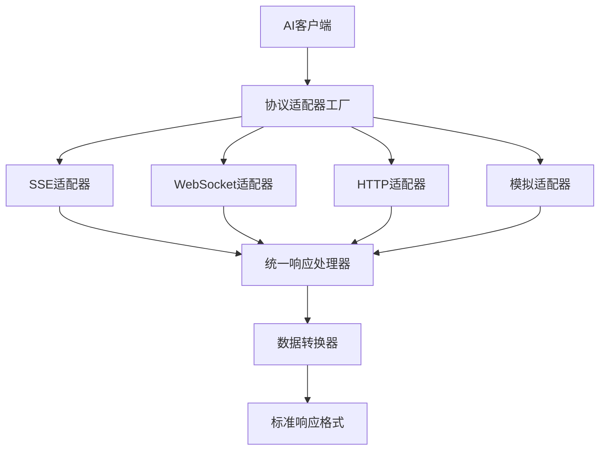

# AI客户端统一API交互规范

## 1. 项目概述

当前AI客户端项目存在API交互协议混乱的问题：
- **SSE流式传输**：通义千问、百度、ChatGLM使用Server-Sent Events
- **模拟数据返回**：部分客户端使用静态模拟数据
- **缺乏统一抽象**：每个客户端独立实现，代码重复且不一致
- **协议扩展困难**：新增协议需要大量重复开发

本文档旨在设计一套统一的API交互规范，支持多种协议的标准化接口，提高代码复用性和可维护性。

## 2. 当前交互模式分析

### 2.1 SSE (Server-Sent Events) 模式

**使用平台**：通义千问、百度、ChatGLM
**实现特点**：
```typescript
// 当前SSE处理实现
const reader = res.body?.getReader();
const decoder = new TextDecoder("utf-8");
let buffer = "";

while (true) {
    const { done, value } = await reader.read();
    if (done) break;
    
    buffer += decoder.decode(value, { stream: true });
    const lines = buffer.split("\n");
    buffer = lines.pop() || "";
    
    for (const line of lines) {
        if (line.startsWith("data: ")) {
            const data = line.slice(6);
            if (data === "[DONE]") return;
            try {
                const parsed = JSON.parse(data);
                yield parsed;
            } catch (e) {
                // 忽略解析错误
            }
        }
    }
}
```

**问题分析**：
- ✅ 支持实时流式传输
- ✅ 浏览器兼容性好
- ❌ 错误处理不完整
- ❌ 重连机制缺失
- ❌ 数据解析逻辑重复

### 2.2 模拟数据模式

**使用平台**：部分客户端示例
**实现特点**：
```typescript
// 当前模拟数据实现
async function* streamResponse(): AsyncIterable<string> {
    yield JSON.stringify({
        choices: [{ delta: { content: "模拟响应: " + message } }]
    });
    yield JSON.stringify({
        choices: [{ delta: { content: "\n感谢您的消息！" } }]
    });
}
```

**问题分析**：
- ✅ 开发调试方便
- ✅ 不依赖外部服务
- ❌ 与真实API差异大
- ❌ 无法测试完整流程
- ❌ 数据格式不统一

### 2.3 WebSocket模式

**当前状态**：暂无实现
**需求分析**：
- 需要支持双向实时通信
- 适用于高频交互场景
- 需要心跳机制和重连策略

## 3. 统一交互协议设计

### 3.1 核心架构



### 3.2 标准化接口定义

```typescript
// 统一请求接口
interface UnifiedRequest {
    method: 'GET' | 'POST' | 'PUT' | 'DELETE';
    url: string;
    headers?: Record<string, string>;
    body?: any;
    timeout?: number;
    retryOptions?: RetryOptions;
}

// 统一响应接口
interface UnifiedResponse<T = any> {
    success: boolean;
    data?: T;
    error?: {
        code: string;
        message: string;
        details?: any;
    };
    metadata?: {
        requestId?: string;
        timestamp: number;
        duration: number;
        protocol: 'SSE' | 'WebSocket' | 'HTTP' | 'MOCK';
    };
}

// 流式响应接口
interface StreamResponse<T = any> {
    type: 'chunk' | 'complete' | 'error' | 'heartbeat';
    data?: T;
    error?: ErrorInfo;
    metadata?: StreamMetadata;
}

// 协议适配器接口
interface ProtocolAdapter {
    readonly protocolType: ProtocolType;
    
    connect(config: ConnectionConfig): Promise<void>;
    disconnect(): Promise<void>;
    send(request: UnifiedRequest): Promise<UnifiedResponse>;
    sendStream(request: UnifiedRequest): AsyncIterable<StreamResponse>;
    isConnected(): boolean;
    getConnectionInfo(): ConnectionInfo;
}
```

### 3.3 协议类型定义

```typescript
enum ProtocolType {
    SSE = 'SSE',
    WEBSOCKET = 'WEBSOCKET',
    HTTP = 'HTTP',
    MOCK = 'MOCK'
}

enum StreamEventType {
    CHUNK = 'chunk',
    COMPLETE = 'complete',
    ERROR = 'error',
    HEARTBEAT = 'heartbeat'
}

interface ConnectionConfig {
    url: string;
    headers?: Record<string, string>;
    timeout?: number;
    retryOptions?: RetryOptions;
    heartbeatInterval?: number;
    maxReconnectAttempts?: number;
}

interface RetryOptions {
    maxAttempts: number;
    delay: number;
    backoff: 'linear' | 'exponential';
    retryCondition?: (error: Error) => boolean;
}
```

## 4. 数据格式标准化

### 4.1 请求数据格式

```typescript
// 标准请求格式
interface AIRequest {
    message: string;
    conversationId?: string;
    parentMessageId?: string;
    model?: string;
    parameters?: {
        temperature?: number;
        maxTokens?: number;
        topP?: number;
        [key: string]: any;
    };
    context?: {
        systemPrompt?: string;
        history?: Message[];
        [key: string]: any;
    };
}

// 平台特定参数映射
interface PlatformRequestMapper {
    mapRequest(request: AIRequest, platform: AIPlatformType): UnifiedRequest;
    mapResponse(response: any, platform: AIPlatformType): UnifiedResponse;
}
```

### 4.2 响应数据格式

```typescript
// 标准响应格式
interface AIResponse {
    content: string;
    conversationId: string;
    messageId: string;
    model: string;
    usage?: {
        promptTokens: number;
        completionTokens: number;
        totalTokens: number;
    };
    finishReason?: 'stop' | 'length' | 'content_filter';
}

// 流式响应块
interface AIStreamChunk {
    delta: {
        content?: string;
        role?: string;
    };
    index: number;
    finishReason?: string;
}
```

### 4.3 错误处理标准

```typescript
// 标准错误格式
interface ErrorInfo {
    code: string;
    message: string;
    details?: any;
    timestamp: number;
    requestId?: string;
    platform?: AIPlatformType;
}

// 错误码定义
enum ErrorCode {
    // 网络相关
    NETWORK_ERROR = 'NETWORK_ERROR',
    TIMEOUT_ERROR = 'TIMEOUT_ERROR',
    CONNECTION_LOST = 'CONNECTION_LOST',
    
    // 认证相关
    AUTH_FAILED = 'AUTH_FAILED',
    TOKEN_EXPIRED = 'TOKEN_EXPIRED',
    RATE_LIMITED = 'RATE_LIMITED',
    
    // 业务相关
    INVALID_REQUEST = 'INVALID_REQUEST',
    CONTENT_FILTERED = 'CONTENT_FILTERED',
    MODEL_UNAVAILABLE = 'MODEL_UNAVAILABLE',
    
    // 系统相关
    INTERNAL_ERROR = 'INTERNAL_ERROR',
    SERVICE_UNAVAILABLE = 'SERVICE_UNAVAILABLE'
}
```

## 5. 协议适配器模式实现

### 5.1 SSE适配器

```typescript
class SSEAdapter implements ProtocolAdapter {
    private eventSource: EventSource | null = null;
    private reconnectAttempts = 0;
    private maxReconnectAttempts = 3;
    private heartbeatTimer: NodeJS.Timeout | null = null;
    
    readonly protocolType = ProtocolType.SSE;
    
    async connect(config: ConnectionConfig): Promise<void> {
        return new Promise((resolve, reject) => {
            this.eventSource = new EventSource(config.url);
            
            this.eventSource.onopen = () => {
                this.reconnectAttempts = 0;
                this.startHeartbeat(config.heartbeatInterval || 30000);
                resolve();
            };
            
            this.eventSource.onerror = (error) => {
                this.handleError(error, reject);
            };
            
            this.eventSource.addEventListener('message', (event) => {
                this.handleMessage(event);
            });
        });
    }
    
    async *sendStream(request: UnifiedRequest): AsyncIterable<StreamResponse> {
        const startTime = Date.now();
        
        try {
            const response = await fetch(request.url, {
                method: request.method,
                headers: {
                    'Accept': 'text/event-stream',
                    'Content-Type': 'application/json',
                    ...request.headers
                },
                body: JSON.stringify(request.body)
            });
            
            if (!response.ok) {
                throw new Error(`HTTP ${response.status}: ${response.statusText}`);
            }
            
            const reader = response.body?.getReader();
            if (!reader) {
                throw new Error('No response body');
            }
            
            yield* this.processSSEStream(reader, startTime);
            
        } catch (error) {
            yield {
                type: StreamEventType.ERROR,
                error: this.createErrorInfo(error),
                metadata: { startTime, endTime: Date.now() }
            };
        }
    }
    
    private async *processSSEStream(
        reader: ReadableStreamDefaultReader<Uint8Array>,
        startTime: number
    ): AsyncIterable<StreamResponse> {
        const decoder = new TextDecoder();
        let buffer = '';
        
        try {
            while (true) {
                const { done, value } = await reader.read();
                
                if (done) {
                    yield {
                        type: StreamEventType.COMPLETE,
                        metadata: { startTime, endTime: Date.now() }
                    };
                    break;
                }
                
                buffer += decoder.decode(value, { stream: true });
                const lines = buffer.split('\n');
                buffer = lines.pop() || '';
                
                for (const line of lines) {
                    if (line.startsWith('data: ')) {
                        const data = line.slice(6);
                        
                        if (data === '[DONE]') {
                            yield {
                                type: StreamEventType.COMPLETE,
                                metadata: { startTime, endTime: Date.now() }
                            };
                            return;
                        }
                        
                        try {
                            const parsedData = JSON.parse(data);
                            yield {
                                type: StreamEventType.CHUNK,
                                data: parsedData,
                                metadata: { startTime, timestamp: Date.now() }
                            };
                        } catch (parseError) {
                            console.warn('Failed to parse SSE data:', data);
                        }
                    }
                }
            }
        } finally {
            reader.releaseLock();
        }
    }
    
    private handleError(error: Event, reject: (reason?: any) => void): void {
        const errorInfo = this.createErrorInfo(error);
        
        if (this.reconnectAttempts < this.maxReconnectAttempts) {
            this.reconnectAttempts++;
            const delay = Math.min(1000 * Math.pow(2, this.reconnectAttempts), 30000);
            
            setTimeout(() => {
                console.log(`Reconnecting attempt ${this.reconnectAttempts}...`);
                // 重新连接逻辑
            }, delay);
        } else {
            reject(errorInfo);
        }
    }
    
    private startHeartbeat(interval: number): void {
        this.heartbeatTimer = setInterval(() => {
            if (this.eventSource?.readyState === EventSource.OPEN) {
                // 发送心跳或检查连接状态
            }
        }, interval);
    }
    
    disconnect(): Promise<void> {
        return new Promise((resolve) => {
            if (this.heartbeatTimer) {
                clearInterval(this.heartbeatTimer);
                this.heartbeatTimer = null;
            }
            
            if (this.eventSource) {
                this.eventSource.close();
                this.eventSource = null;
            }
            
            resolve();
        });
    }
    
    isConnected(): boolean {
        return this.eventSource?.readyState === EventSource.OPEN;
    }
    
    getConnectionInfo(): ConnectionInfo {
        return {
            protocol: this.protocolType,
            connected: this.isConnected(),
            url: this.eventSource?.url || '',
            readyState: this.eventSource?.readyState || 0
        };
    }
    
    private createErrorInfo(error: any): ErrorInfo {
        return {
            code: ErrorCode.CONNECTION_LOST,
            message: error.message || 'SSE connection error',
            details: error,
            timestamp: Date.now()
        };
    }
}
```

### 5.2 WebSocket适配器

```typescript
class WebSocketAdapter implements ProtocolAdapter {
    private ws: WebSocket | null = null;
    private messageQueue: any[] = [];
    private reconnectAttempts = 0;
    private heartbeatTimer: NodeJS.Timeout | null = null;
    private pendingRequests = new Map<string, {
        resolve: (value: any) => void;
        reject: (error: any) => void;
        timeout: NodeJS.Timeout;
    }>();
    
    readonly protocolType = ProtocolType.WEBSOCKET;
    
    async connect(config: ConnectionConfig): Promise<void> {
        return new Promise((resolve, reject) => {
            try {
                this.ws = new WebSocket(config.url);
                
                this.ws.onopen = () => {
                    this.reconnectAttempts = 0;
                    this.startHeartbeat(config.heartbeatInterval || 30000);
                    this.flushMessageQueue();
                    resolve();
                };
                
                this.ws.onmessage = (event) => {
                    this.handleMessage(event.data);
                };
                
                this.ws.onerror = (error) => {
                    reject(this.createErrorInfo(error));
                };
                
                this.ws.onclose = () => {
                    this.handleDisconnection(config);
                };
                
            } catch (error) {
                reject(this.createErrorInfo(error));
            }
        });
    }
    
    async send(request: UnifiedRequest): Promise<UnifiedResponse> {
        if (!this.isConnected()) {
            throw new Error('WebSocket not connected');
        }
        
        const requestId = this.generateRequestId();
        
        return new Promise((resolve, reject) => {
            const timeout = setTimeout(() => {
                this.pendingRequests.delete(requestId);
                reject(new Error('Request timeout'));
            }, request.timeout || 30000);
            
            this.pendingRequests.set(requestId, {
                resolve,
                reject,
                timeout
            });
            
            const message = {
                id: requestId,
                method: request.method,
                headers: request.headers,
                body: request.body,
                timestamp: Date.now()
            };
            
            this.ws?.send(JSON.stringify(message));
        });
    }
    
    async *sendStream(request: UnifiedRequest): AsyncIterable<StreamResponse> {
        const startTime = Date.now();
        
        try {
            const response = await this.send(request);
            
            // WebSocket流式响应处理
            yield* this.processWebSocketStream(response, startTime);
            
        } catch (error) {
            yield {
                type: StreamEventType.ERROR,
                error: this.createErrorInfo(error),
                metadata: { startTime, endTime: Date.now() }
            };
        }
    }
    
    private async *processWebSocketStream(
        response: any,
        startTime: number
    ): AsyncIterable<StreamResponse> {
        // WebSocket流式处理逻辑
        // 这里需要根据具体的WebSocket协议格式来处理
        
        yield {
            type: StreamEventType.CHUNK,
            data: response,
            metadata: { startTime, timestamp: Date.now() }
        };
        
        yield {
            type: StreamEventType.COMPLETE,
            metadata: { startTime, endTime: Date.now() }
        };
    }
    
    private handleMessage(data: string): void {
        try {
            const message = JSON.parse(data);
            const requestId = message.id;
            
            const pendingRequest = this.pendingRequests.get(requestId);
            if (pendingRequest) {
                clearTimeout(pendingRequest.timeout);
                this.pendingRequests.delete(requestId);
                
                if (message.error) {
                    pendingRequest.reject(message.error);
                } else {
                    pendingRequest.resolve(message);
                }
            }
        } catch (error) {
            console.error('Failed to parse WebSocket message:', error);
        }
    }
    
    private handleDisconnection(config: ConnectionConfig): void {
        if (this.heartbeatTimer) {
            clearInterval(this.heartbeatTimer);
            this.heartbeatTimer = null;
        }
        
        // 清理所有pending请求
        this.pendingRequests.forEach(({ reject, timeout }) => {
            clearTimeout(timeout);
            reject(new Error('Connection lost'));
        });
        this.pendingRequests.clear();
        
        // 重连逻辑
        if (this.reconnectAttempts < (config.maxReconnectAttempts || 3)) {
            this.reconnectAttempts++;
            const delay = Math.min(1000 * Math.pow(2, this.reconnectAttempts), 30000);
            
            setTimeout(() => {
                console.log(`WebSocket reconnecting attempt ${this.reconnectAttempts}...`);
                this.connect(config).catch(console.error);
            }, delay);
        }
    }
    
    private startHeartbeat(interval: number): void {
        this.heartbeatTimer = setInterval(() => {
            if (this.isConnected()) {
                this.ws?.send(JSON.stringify({ type: 'ping', timestamp: Date.now() }));
            }
        }, interval);
    }
    
    private flushMessageQueue(): void {
        while (this.messageQueue.length > 0 && this.isConnected()) {
            const message = this.messageQueue.shift();
            this.ws?.send(JSON.stringify(message));
        }
    }
    
    disconnect(): Promise<void> {
        return new Promise((resolve) => {
            if (this.heartbeatTimer) {
                clearInterval(this.heartbeatTimer);
                this.heartbeatTimer = null;
            }
            
            if (this.ws) {
                this.ws.close();
                this.ws = null;
            }
            
            resolve();
        });
    }
    
    isConnected(): boolean {
        return this.ws?.readyState === WebSocket.OPEN;
    }
    
    getConnectionInfo(): ConnectionInfo {
        return {
            protocol: this.protocolType,
            connected: this.isConnected(),
            url: this.ws?.url || '',
            readyState: this.ws?.readyState || 0
        };
    }
    
    private generateRequestId(): string {
        return `ws-${Date.now()}-${Math.random().toString(36).substr(2, 9)}`;
    }
    
    private createErrorInfo(error: any): ErrorInfo {
        return {
            code: ErrorCode.CONNECTION_LOST,
            message: error.message || 'WebSocket connection error',
            details: error,
            timestamp: Date.now()
        };
    }
}
```

### 5.3 模拟适配器

```typescript
class MockAdapter implements ProtocolAdapter {
    private connected = false;
    private responseDelay = 100; // 模拟延迟
    
    readonly protocolType = ProtocolType.MOCK;
    
    async connect(): Promise<void> {
        // 模拟连接延迟
        await this.delay(this.responseDelay);
        this.connected = true;
    }
    
    async send(request: UnifiedRequest): Promise<UnifiedResponse> {
        await this.delay(this.responseDelay);
        
        return {
            success: true,
            data: this.generateMockResponse(request),
            metadata: {
                protocol: this.protocolType,
                timestamp: Date.now(),
                duration: this.responseDelay
            }
        };
    }
    
    async *sendStream(request: UnifiedRequest): AsyncIterable<StreamResponse> {
        const startTime = Date.now();
        const chunks = this.generateMockStreamChunks(request);
        
        try {
            for (let i = 0; i < chunks.length; i++) {
                await this.delay(50); // 模拟流式延迟
                
                yield {
                    type: i === chunks.length - 1 ? StreamEventType.COMPLETE : StreamEventType.CHUNK,
                    data: chunks[i],
                    metadata: { startTime, timestamp: Date.now() }
                };
            }
        } catch (error) {
            yield {
                type: StreamEventType.ERROR,
                error: this.createErrorInfo(error),
                metadata: { startTime, endTime: Date.now() }
            };
        }
    }
    
    private generateMockResponse(request: UnifiedRequest): any {
        const message = request.body?.message || '测试消息';
        
        return {
            id: `mock-${Date.now()}`,
            choices: [{
                message: {
                    content: `这是模拟响应: ${message}`,
                    role: 'assistant'
                },
                finish_reason: 'stop'
            }],
            usage: {
                prompt_tokens: message.length,
                completion_tokens: 50,
                total_tokens: message.length + 50
            }
        };
    }
    
    private generateMockStreamChunks(request: UnifiedRequest): any[] {
        const message = request.body?.message || '测试消息';
        const words = `这是模拟的流式响应: ${message}。感谢您的消息！`.split(' ');
        
        return words.map((word, index) => ({
            choices: [{
                delta: {
                    content: word + (index < words.length - 1 ? ' ' : '')
                },
                index: 0
            }]
        }));
    }
    
    disconnect(): Promise<void> {
        this.connected = false;
        return Promise.resolve();
    }
    
    isConnected(): boolean {
        return this.connected;
    }
    
    getConnectionInfo(): ConnectionInfo {
        return {
            protocol: this.protocolType,
            connected: this.connected,
            url: 'mock://localhost',
            readyState: this.connected ? 1 : 3
        };
    }
    
    private delay(ms: number): Promise<void> {
        return new Promise(resolve => setTimeout(resolve, ms));
    }
    
    private createErrorInfo(error: any): ErrorInfo {
        return {
            code: ErrorCode.INTERNAL_ERROR,
            message: error.message || 'Mock adapter error',
            details: error,
            timestamp: Date.now()
        };
    }
}
```

### 5.4 适配器工厂

```typescript
class ProtocolAdapterFactory {
    private static adapters = new Map<ProtocolType, new () => ProtocolAdapter>();
    
    static {
        // 注册默认适配器
        this.registerAdapter(ProtocolType.SSE, SSEAdapter);
        this.registerAdapter(ProtocolType.WEBSOCKET, WebSocketAdapter);
        this.registerAdapter(ProtocolType.HTTP, HTTPAdapter);
        this.registerAdapter(ProtocolType.MOCK, MockAdapter);
    }
    
    static registerAdapter(type: ProtocolType, adapterClass: new () => ProtocolAdapter): void {
        this.adapters.set(type, adapterClass);
    }
    
    static createAdapter(type: ProtocolType): ProtocolAdapter {
        const AdapterClass = this.adapters.get(type);
        if (!AdapterClass) {
            throw new Error(`No adapter registered for protocol type: ${type}`);
        }
        
        return new AdapterClass();
    }
    
    static createAdapterForPlatform(platform: AIPlatformType): ProtocolAdapter {
        // 根据平台特性选择合适的协议
        const protocolMap = {
            [AIPlatformType.QWEN]: ProtocolType.SSE,
            [AIPlatformType.BAIDU]: ProtocolType.SSE,
            [AIPlatformType.CHATGLM]: ProtocolType.SSE,
            [AIPlatformType.DEEPSEEK]: ProtocolType.SSE,
            [AIPlatformType.TONGYI]: ProtocolType.SSE
        };
        
        const protocolType = protocolMap[platform] || ProtocolType.MOCK;
        return this.createAdapter(protocolType);
    }
    
    static getSupportedProtocols(): ProtocolType[] {
        return Array.from(this.adapters.keys());
    }
    
    static isProtocolSupported(type: ProtocolType): boolean {
        return this.adapters.has(type);
    }
}
```

## 6. 性能优化策略

### 6.1 连接池管理

```typescript
interface ConnectionPoolConfig {
    maxConnections: number;
    idleTimeout: number;
    healthCheckInterval: number;
    evictionInterval: number;
}

class ConnectionPool {
    private connections = new Map<string, PooledConnection>();
    private config: ConnectionPoolConfig;
    
    constructor(config: ConnectionPoolConfig) {
        this.config = config;
        this.startMaintenanceTasks();
    }
    
    async acquireConnection(
        key: string,
        adapter: ProtocolAdapter,
        config: ConnectionConfig
    ): Promise<PooledConnection> {
        let pooledConnection = this.connections.get(key);
        
        if (pooledConnection && pooledConnection.isHealthy()) {
            pooledConnection.lastUsed = Date.now();
            return pooledConnection;
        }
        
        // 创建新连接
        await adapter.connect(config);
        
        pooledConnection = new PooledConnection(key, adapter, config);
        this.connections.set(key, pooledConnection);
        
        return pooledConnection;
    }
    
    releaseConnection(key: string): void {
        const connection = this.connections.get(key);
        if (connection) {
            connection.inUse = false;
            connection.lastReleased = Date.now();
        }
    }
    
    private startMaintenanceTasks(): void {
        // 健康检查
        setInterval(() => {
            this.performHealthChecks();
        }, this.config.healthCheckInterval);
        
        // 空闲连接清理
        setInterval(() => {
            this.evictIdleConnections();
        }, this.config.evictionInterval);
    }
    
    private async performHealthChecks(): Promise<void> {
        for (const [key, connection] of this.connections) {
            if (!connection.inUse && !connection.isHealthy()) {
                await this.removeConnection(key);
            }
        }
    }
    
    private async evictIdleConnections(): Promise<void> {
        const now = Date.now();
        
        for (const [key, connection] of this.connections) {
            if (!connection.inUse && 
                (now - connection.lastReleased) > this.config.idleTimeout) {
                await this.removeConnection(key);
            }
        }
    }
    
    private async removeConnection(key: string): Promise<void> {
        const connection = this.connections.get(key);
        if (connection) {
            await connection.adapter.disconnect();
            this.connections.delete(key);
        }
    }
    
    async closeAll(): Promise<void> {
        const promises = Array.from(this.connections.keys()).map(key => 
            this.removeConnection(key)
        );
        
        await Promise.all(promises);
    }
    
    getStats(): ConnectionPoolStats {
        const total = this.connections.size;
        const active = Array.from(this.connections.values()).filter(c => c.inUse).length;
        const idle = total - active;
        
        return {
            total,
            active,
            idle,
            maxConnections: this.config.maxConnections
        };
    }
}

class PooledConnection {
    key: string;
    adapter: ProtocolAdapter;
    config: ConnectionConfig;
    inUse = false;
    lastUsed = Date.now();
    lastReleased = Date.now();
    errorCount = 0;
    
    constructor(key: string, adapter: ProtocolAdapter, config: ConnectionConfig) {
        this.key = key;
        this.adapter = adapter;
        this.config = config;
    }
    
    isHealthy(): boolean {
        return this.adapter.isConnected() && this.errorCount < 3;
    }
    
    recordError(): void {
        this.errorCount++;
    }
    
    resetErrorCount(): void {
        this.errorCount = 0;
    }
}
```

### 6.2 重试机制

```typescript
class RetryManager {
    async executeWithRetry<T>(
        operation: () => Promise<T>,
        options: RetryOptions
    ): Promise<T> {
        let lastError: Error;
        
        for (let attempt = 1; attempt <= options.maxAttempts; attempt++) {
            try {
                const result = await operation();
                return result;
            } catch (error) {
                lastError = error as Error;
                
                if (attempt === options.maxAttempts) {
                    break;
                }
                
                if (options.retryCondition && !options.retryCondition(lastError)) {
                    throw lastError;
                }
                
                const delay = this.calculateDelay(options, attempt);
                await this.sleep(delay);
            }
        }
        
        throw lastError!;
    }
    
    private calculateDelay(options: RetryOptions, attempt: number): number {
        if (options.backoff === 'exponential') {
            return options.delay * Math.pow(2, attempt - 1);
        }
        return options.delay;
    }
    
    private sleep(ms: number): Promise<void> {
        return new Promise(resolve => setTimeout(resolve, ms));
    }
}
```

### 6.3 超时控制

```typescript
interface TimeoutOptions {
    requestTimeout: number;
    connectionTimeout: number;
    idleTimeout: number;
}

class TimeoutManager {
    createTimeoutPromise<T>(ms: number, message: string): Promise<T> {
        return new Promise((_, reject) => {
            const timer = setTimeout(() => {
                reject(new Error(message));
            }, ms);
            
            // 返回一个可以清除timeout的函数
            return { timer, clear: () => clearTimeout(timer) } as any;
        });
    }
    
    async withTimeout<T>(
        promise: Promise<T>,
        timeoutMs: number,
        timeoutMessage = 'Operation timed out'
    ): Promise<T> {
        const timeoutPromise = this.createTimeoutPromise<T>(timeoutMs, timeoutMessage);
        
        try {
            return await Promise.race([promise, timeoutPromise]);
        } finally {
            // 清理timeout
            if ('clear' in timeoutPromise) {
                timeoutPromise.clear();
            }
        }
    }
}
```

## 7. 监控和日志规范

### 7.1 性能监控

```typescript
interface PerformanceMetrics {
    requestCount: number;
    successCount: number;
    errorCount: number;
    averageResponseTime: number;
    p95ResponseTime: number;
    p99ResponseTime: number;
    connectionPoolStats: ConnectionPoolStats;
}

interface ConnectionPoolStats {
    total: number;
    active: number;
    idle: number;
    maxConnections: number;
}

class PerformanceMonitor {
    private metrics = new Map<string, MetricData>();
    private histogram = new Map<string, number[]>();
    
    recordRequest(platform: AIPlatformType, duration: number, success: boolean): void {
        const key = `requests_${platform}`;
        const metric = this.getOrCreateMetric(key);
        
        metric.count++;
        if (success) {
            metric.successCount++;
        } else {
            metric.errorCount++;
        }
        
        this.recordDuration(key, duration);
    }
    
    recordConnectionEvent(platform: AIPlatformType, event: string): void {
        const key = `connections_${platform}_${event}`;
        const metric = this.getOrCreateMetric(key);
        metric.count++;
    }
    
    private getOrCreateMetric(key: string): MetricData {
        if (!this.metrics.has(key)) {
            this.metrics.set(key, {
                count: 0,
                successCount: 0,
                errorCount: 0,
                totalDuration: 0
            });
        }
        
        return this.metrics.get(key)!;
    }
    
    private recordDuration(key: string, duration: number): void {
        if (!this.histogram.has(key)) {
            this.histogram.set(key, []);
        }
        
        this.histogram.get(key)!.push(duration);
        
        // 保持数据点数量在合理范围内
        const durations = this.histogram.get(key)!;
        if (durations.length > 1000) {
            durations.shift();
        }
    }
    
    getMetrics(platform?: AIPlatformType): PerformanceMetrics {
        const platformKey = platform ? `requests_${platform}` : 'requests_all';
        const durations = this.histogram.get(platformKey) || [];
        
        return {
            requestCount: this.getMetricCount(platformKey),
            successCount: this.getSuccessCount(platformKey),
            errorCount: this.getErrorCount(platformKey),
            averageResponseTime: this.calculateAverage(durations),
            p95ResponseTime: this.calculatePercentile(durations, 0.95),
            p99ResponseTime: this.calculatePercentile(durations, 0.99),
            connectionPoolStats: this.getConnectionPoolStats()
        };
    }
    
    private getMetricCount(key: string): number {
        return this.metrics.get(key)?.count || 0;
    }
    
    private getSuccessCount(key: string): number {
        return this.metrics.get(key)?.successCount || 0;
    }
    
    private getErrorCount(key: string): number {
        return this.metrics.get(key)?.errorCount || 0;
    }
    
    private calculateAverage(durations: number[]): number {
        if (durations.length === 0) return 0;
        return durations.reduce((sum, d) => sum + d, 0) / durations.length;
    }
    
    private calculatePercentile(durations: number[], percentile: number): number {
        if (durations.length === 0) return 0;
        
        const sorted = [...durations].sort((a, b) => a - b);
        const index = Math.ceil(sorted.length * percentile) - 1;
        return sorted[Math.max(0, index)];
    }
    
    private getConnectionPoolStats(): ConnectionPoolStats {
        // 这里需要从连接池获取实际数据
        return {
            total: 0,
            active: 0,
            idle: 0,
            maxConnections: 100
        };
    }
    
    reset(): void {
        this.metrics.clear();
        this.histogram.clear();
    }
}

interface MetricData {
    count: number;
    successCount: number;
    errorCount: number;
    totalDuration: number;
}
```

### 7.2 日志规范

```typescript
enum LogLevel {
    DEBUG = 'DEBUG',
    INFO = 'INFO',
    WARN = 'WARN',
    ERROR = 'ERROR',
    FATAL = 'FATAL'
}

interface LogEntry {
    timestamp: number;
    level: LogLevel;
    category: string;
    message: string;
    data?: any;
    error?: Error;
    requestId?: string;
    platform?: AIPlatformType;
    duration?: number;
}

class Logger {
    private static instance: Logger;
    private logs: LogEntry[] = [];
    private maxLogs = 10000;
    private enableConsole = true;
    private enablePersistence = false;
    
    static getInstance(): Logger {
        if (!Logger.instance) {
            Logger.instance = new Logger();
        }
        return Logger.instance;
    }
    
    debug(category: string, message: string, data?: any): void {
        this.log(LogLevel.DEBUG, category, message, data);
    }
    
    info(category: string, message: string, data?: any): void {
        this.log(LogLevel.INFO, category, message, data);
    }
    
    warn(category: string, message: string, data?: any, error?: Error): void {
        this.log(LogLevel.WARN, category, message, data, error);
    }
    
    error(category: string, message: string, error?: Error, data?: any): void {
        this.log(LogLevel.ERROR, category, message, data, error);
    }
    
    fatal(category: string, message: string, error?: Error, data?: any): void {
        this.log(LogLevel.FATAL, category, message, data, error);
    }
    
    private log(
        level: LogLevel,
        category: string,
        message: string,
        data?: any,
        error?: Error
    ): void {
        const entry: LogEntry = {
            timestamp: Date.now(),
            level,
            category,
            message,
            data,
            error
        };
        
        this.logs.push(entry);
        
        // 限制日志数量
        if (this.logs.length > this.maxLogs) {
            this.logs.shift();
        }
        
        // 控制台输出
        if (this.enableConsole) {
            this.consoleOutput(entry);
        }
        
        // 持久化存储
        if (this.enablePersistence) {
            this.persistLog(entry);
        }
    }
    
    private consoleOutput(entry: LogEntry): void {
        const timestamp = new Date(entry.timestamp).toISOString();
        const prefix = `[${timestamp}] [${entry.level}] [${entry.category}]`;
        
        switch (entry.level) {
            case LogLevel.DEBUG:
                console.debug(prefix, entry.message, entry.data || '');
                break;
            case LogLevel.INFO:
                console.info(prefix, entry.message, entry.data || '');
                break;
            case LogLevel.WARN:
                console.warn(prefix, entry.message, entry.data || '', entry.error || '');
                break;
            case LogLevel.ERROR:
            case LogLevel.FATAL:
                console.error(prefix, entry.message, entry.data || '', entry.error || '');
                break;
        }
    }
    
    private persistLog(entry: LogEntry): void {
        // 实现日志持久化逻辑
        // 可以写入文件、发送到日志服务等
    }
    
    getLogs(
        level?: LogLevel,
        category?: string,
        startTime?: number,
        endTime?: number
    ): LogEntry[] {
        return this.logs.filter(entry => {
            if (level && entry.level !== level) return false;
            if (category && entry.category !== category) return false;
            if (startTime && entry.timestamp < startTime) return false;
            if (endTime && entry.timestamp > endTime) return false;
            return true;
        });
    }
    
    clear(): void {
        this.logs = [];
    }
    
    export(format: 'json' | 'csv' = 'json'): string {
        const logs = this.getLogs();
        
        if (format === 'json') {
            return JSON.stringify(logs, null, 2);
        } else if (format === 'csv') {
            const headers = ['timestamp', 'level', 'category', 'message'];
            const rows = logs.map(entry => [
                new Date(entry.timestamp).toISOString(),
                entry.level,
                entry.category,
                `"${entry.message.replace(/"/g, '""')}"`
            ]);
            
            return [headers, ...rows].map(row => row.join(',')).join('\n');
        }
        
        return '';
    }
}

// 便捷函数
export const logger = Logger.getInstance();
```

### 7.3 监控告警

```typescript
interface AlertRule {
    name: string;
    condition: (metrics: PerformanceMetrics) => boolean;
    severity: 'info' | 'warning' | 'critical';
    cooldown: number; // 冷却时间（毫秒）
    notificationChannels: string[];
}

class AlertManager {
    private rules: AlertRule[] = [];
    private lastAlertTime = new Map<string, number>();
    
    addRule(rule: AlertRule): void {
        this.rules.push(rule);
    }
    
    checkAlerts(metrics: PerformanceMetrics): Alert[] {
        const alerts: Alert[] = [];
        const now = Date.now();
        
        for (const rule of this.rules) {
            if (rule.condition(metrics)) {
                const lastAlert = this.lastAlertTime.get(rule.name) || 0;
                
                // 检查冷却时间
                if (now - lastAlert > rule.cooldown) {
                    alerts.push({
                        ruleName: rule.name,
                        severity: rule.severity,
                        message: this.generateAlertMessage(rule, metrics),
                        timestamp: now,
                        metrics
                    });
                    
                    this.lastAlertTime.set(rule.name, now);
                }
            }
        }
        
        return alerts;
    }
    
    private generateAlertMessage(rule: AlertRule, metrics: PerformanceMetrics): string {
        return `Alert: ${rule.name} - Request success rate: ${
            metrics.requestCount > 0 ? 
            ((metrics.successCount / metrics.requestCount) * 100).toFixed(2) : 0
        }%, Average response time: ${metrics.averageResponseTime.toFixed(2)}ms`;
    }
}

interface Alert {
    ruleName: string;
    severity: 'info' | 'warning' | 'critical';
    message: string;
    timestamp: number;
    metrics: PerformanceMetrics;
}
```

## 8. 实施建议

### 8.1 迁移策略

1. **第一阶段：基础框架**（1-2周）
   - 实现统一接口定义
   - 开发协议适配器工厂
   - 创建SSE适配器

2. **第二阶段：协议扩展**（2-3周）
   - 实现WebSocket适配器
   - 完善HTTP适配器
   - 优化模拟适配器

3. **第三阶段：性能优化**（1-2周）
   - 集成连接池管理
   - 实现重试机制
   - 添加超时控制

4. **第四阶段：监控完善**（1周）
   - 性能监控集成
   - 日志系统完善
   - 告警机制实现

### 8.2 测试策略

```typescript
// 单元测试示例
describe('SSEAdapter', () => {
    let adapter: SSEAdapter;
    let mockEventSource: MockEventSource;
    
    beforeEach(() => {
        adapter = new SSEAdapter();
        mockEventSource = new MockEventSource();
        // Mock EventSource
    });
    
    test('should handle successful connection', async () => {
        const config: ConnectionConfig = {
            url: 'http://test.com/sse'
        };
        
        await adapter.connect(config);
        expect(adapter.isConnected()).toBe(true);
    });
    
    test('should process SSE stream correctly', async () => {
        const request: UnifiedRequest = {
            method: 'POST',
            url: 'http://test.com/chat',
            body: { message: 'Hello' }
        };
        
        const responses = [];
        for await (const response of adapter.sendStream(request)) {
            responses.push(response);
        }
        
        expect(responses).toHaveLength(3); // chunk, chunk, complete
        expect(responses[responses.length - 1].type).toBe(StreamEventType.COMPLETE);
    });
});
```

### 8.3 性能目标

- **响应时间**：P95 < 500ms，P99 < 1000ms
- **成功率**：> 99.9%
- **并发处理**：支持 1000+ 并发连接
- **资源使用**：内存 < 500MB，CPU < 30%
- **重连时间**：< 5秒

## 9. 总结

本统一API交互规范解决了当前AI客户端项目中的协议混乱问题，提供了：

1. **标准化接口**：统一的请求/响应格式，降低开发复杂度
2. **协议适配**：支持SSE、WebSocket、HTTP等多种协议
3. **性能优化**：连接池、重试、超时等机制提升稳定性
4. **监控完善**：完整的性能监控和日志系统
5. **易于扩展**：适配器模式支持快速添加新协议

通过实施本规范，项目将获得更好的可维护性、扩展性和稳定性，为后续功能开发奠定坚实基础。