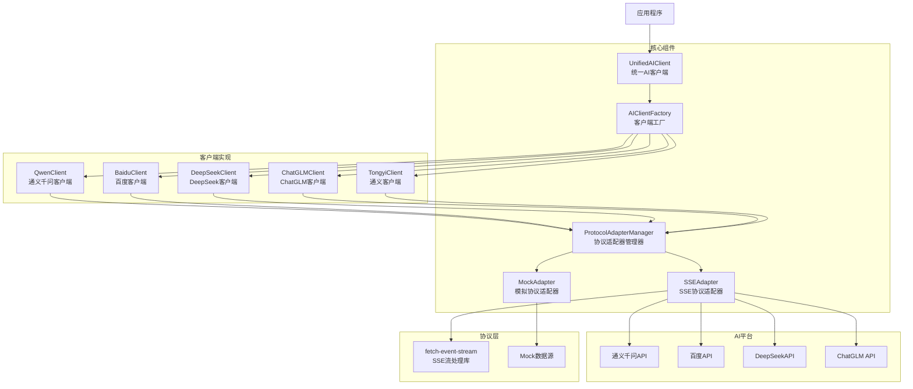

# 项目清单

## 服务功能调用关系图

## 组件说明

### 核心组件
- **UnifiedAIClient**: 统一AI客户端，对外提供统一接口
- **AIClientFactory**: 客户端工厂，负责创建不同平台的客户端实例
- **ProtocolAdapterManager**: 协议适配器管理器，管理不同协议的适配器
- **SSEAdapter**: SSE协议适配器，处理SSE流式通信
- **MockAdapter**: 模拟协议适配器，用于开发和测试

### 客户端实现
- **QwenClient**: 通义千问客户端
- **BaiduClient**: 百度客户端
- **DeepSeekClient**: DeepSeek客户端
- **ChatGLMClient**: ChatGLM客户端
- **TongyiClient**: 通义客户端

### 协议层
- **SSE协议**: 基于fetch-event-stream库实现的SSE流式通信
- **Mock协议**: 模拟数据协议，用于开发测试环境